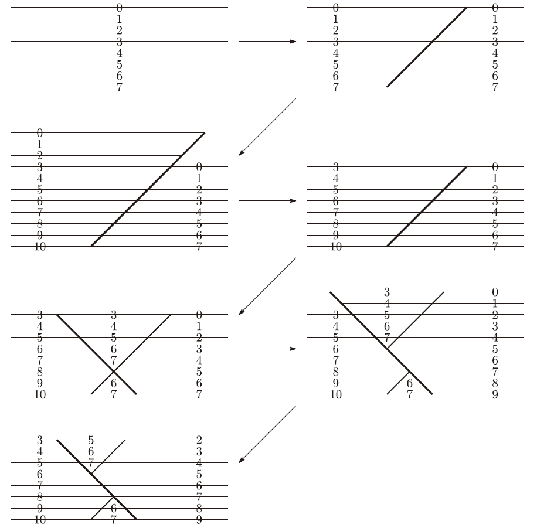

# 断层 (fault.cpp)

## 题目描述

无数生命的遗迹埋藏在地下。作为一位地质学家，你致力于探索岩石的故事。这次你要在一条直线形的河岸边开展研究。这里在无数年前经历过一次火山喷发，被夷为了平地。你在这里建立坐标系，将河岸看作 $x$ 轴，高度看作 $y$ 轴，即用直线 $y=0$ 表示地表，$y>0$ 表示地上，$y<0$ 表示地下，火山喷发 $a$ 年前 $(a\geq 0)$ 的地层原本位于直线 $y=-a$ 的位置。

经过调查，你得知在火山喷发后，这个地区一共经历过 $Q$ 次地壳运动，其中第 $i$ 次地壳运动可由位置 $X_i$,方向 $D_i$,变动量 $L_i$ 三个参数来表示，其中 $D_i$ 为 $1$ 或 $2$。地壳运动的方式如下所述：

- 首先地层发生移动，移动方式如下：
  - 若 $D_i=1$，则裂缝是一条经过点 $(X_i,0)$ 的斜率为 $1$ 的直线。位于这条直线上侧的地层沿直线方向上移了 $L_i$ 的高度。即直线上侧的点 $(x,y)$ 会移动到 $(x+L_i,y+L_i)$ 处。
  - 若 $D_i=2$，则裂缝是一条经过点 $(X_i,0)$ 的斜率为 $-1$ 的直线。位于这条直线上侧的地层沿直线方向上移了 $L_i$ 的高度。即直线上侧的点 $(x,y)$ 会移动到 $(x-L_i,y+L_i)$ 处。
- 地层移动结束后，位于 $y>0$ 位置的地层会因风化而消失。

如今，你想要知道地表各处的地层分别是火山喷发前多少年的地层，然后发一篇 Nature。

## 输入格式

输入文件第一行包含两个整数 $N,Q$，分别表示询问的位置数量和地壳运动的次数。

下面 $Q$ 行，每行描述一次地壳运动。第 $i$ 行包含 $3$ 个整数 $X_i,D_i,L_i$，分别表示第 $i$ 次地壳运动的位置、方向和变动量。

## 输出格式

输出 $N$ 行，第 $i$ 行输出如今 $(i-1,0)$ 和 $(i,0)$ 两点间的地表地层是火山喷发前多少年的地层。

## 样例输入1

```
10 2
12 1 3
2 2 2
```

## 样例输出1

```
3
3
5
5
5
5
5
5
2
2
```

说明：地壳运动情况如下图。



## 样例输入2

```
15 10
28 1 7
-24 2 1
1 1 1
8 1 1
6 2 1
20 1 3
12 2 2
-10 1 3
7 2 1
5 1 2
```

## 样例输出2

```
15
14
14
14
14
12
12
12
12
12
12
12
15
15
12
```

## 数据规模与约定

对于 $20\%$ 的数据，$N\leq 100, Q\leq 100, -100\leq X_i\leq 100, L_i=1$。

对于 $50\%$ 的数据，$N\leq 3000, Q\leq 3000$。

对于$100\%$ 的数据，$1\leq N\leq 200000,1\leq Q\leq 200000, -10^9\leq X_i\leq 10^9, 1\leq D_i\leq 2, 1\leq L_i\leq 10^9$。

